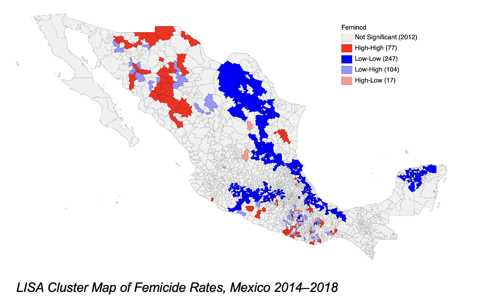
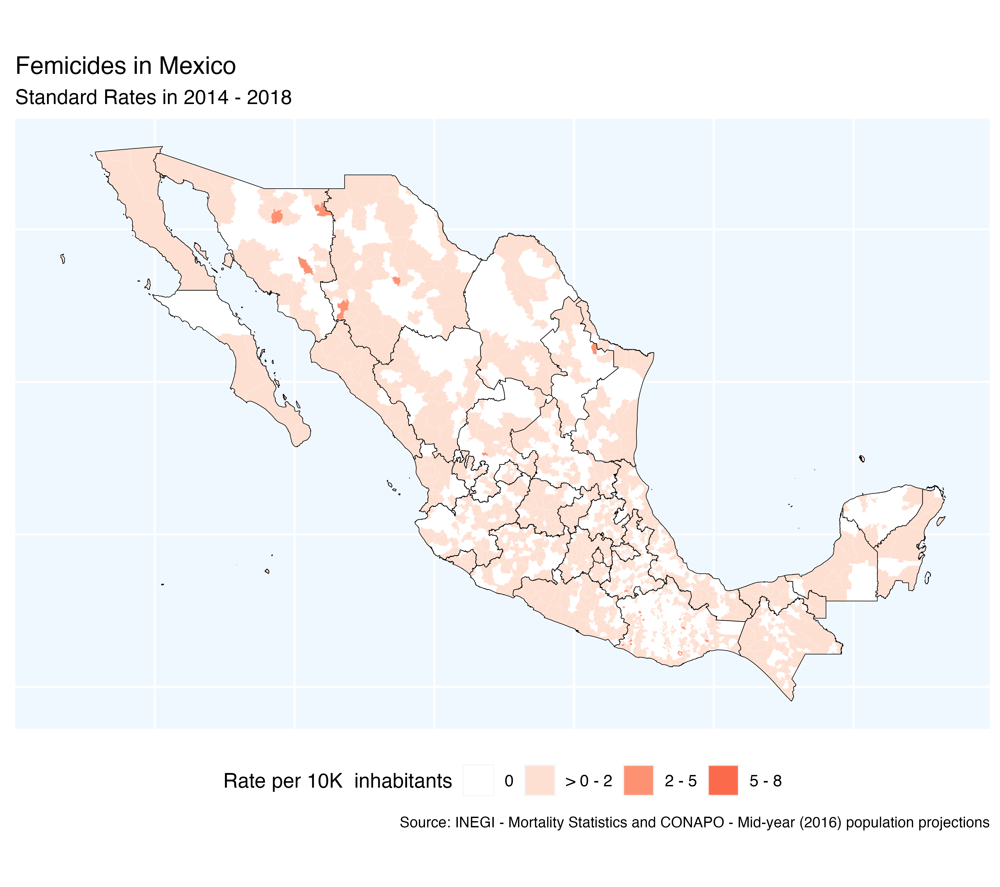
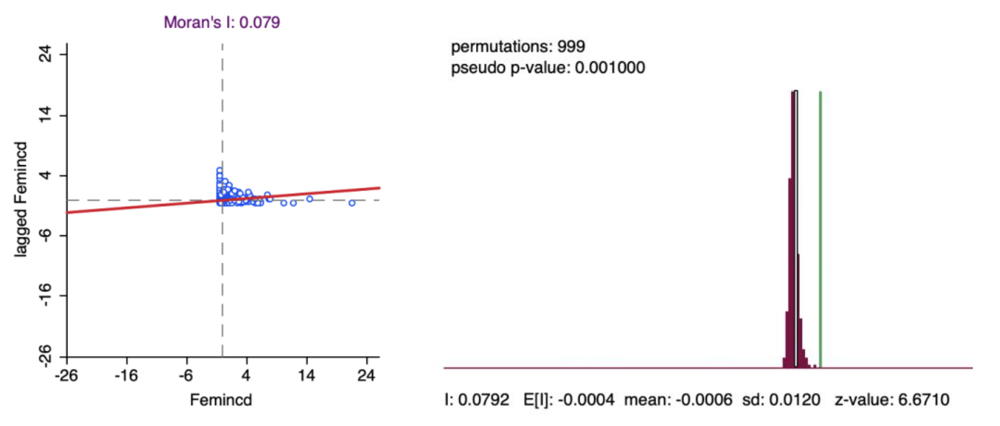

Initial README publication with structure, findings, and cartographic outputs.

# Geospatial Analysis of Femicides in Mexico (2014–2018)

Investigative geostatistical modeling of femicides across Mexican municipalities using open INEGI data, proposing a spatial classification methodology to identify clusters and inform decision-making.

---

## Context

Femicide is a critical social issue in Mexico that has neither been recognized in official records nor identified as a phenomenon significantly linked to geographic space, due to a lack of research and gender perspective.

This project explores femicide incidence between 2014 and 2018 to test the hypothesis of significant regional variations. It also examines spatial patterns to identify clusters and propose a methodology that can be extended to future analyses.

Originally developed as my undergraduate thesis in Actuarial Science at UNAM: research completed in 2021, formally defended in 2025.

---

## Objectives

- Identify and classify femicides in the official records of the Registered Deaths Statistics of INEGI.
- Assess whether Mexican municipal femicide incidence rates show spatial dependence.
- Identify spatial clusters of municipal femicide incidence rates.
- Contribute an open-source, transparent analytical framework.

---

## Data

- **Source:** [INEGI open datasets — Registered Deaths Statistics](https://www.inegi.org.mx/programas/edr/#microdatos)
- **Period:** 2014–2018
- **Granularity:** Municipal-level

---

## Methodology

- Data cleaning and geospatial preparation with R and sf/rgeos.
- Exploratory spatial analysis (Moran's I, LISA, hotspot detection).
- Classification methodology proposed for identifying femicide clusters.
- Visualization of results in cartographic outputs.

---

## Tech Stack

- **Language:** R
- **Key packages:** sf, rgeos, spdep, GeoDA, ggplot2, tmap
- **Data sources:** INEGI open data (municipal shapefiles + statistics)

---

## Repository Structure

```
geostatistics-clustering-mexico/
├── data/
│   ├── raw/            # Original INEGI datasets
│   └── processed/      # Cleaned & prepared data
├── notebooks/          # R Markdown / Jupyter analytical notebooks
├── src/                # Reusable functions
├── outputs/
│   ├── maps/           # Cartographic outputs (PNG)
│   └── reports/        # Reports (PDF if applicable)
├── .gitignore
├── LICENSE
└── README.md
```

---


## Key Findings

- Femicide rates show statistically significant spatial dependence across Mexican municipalities: **77 municipalities form High-High clusters** (concentrated in northern border states and the Guerrero–Oaxaca region), while **247 form Low-Low clusters** in central and southeastern Mexico.
- Regional social context influences the spatial–femicide relationship, with distinct concentration patterns emerging along the northern border versus the country's interior.
- Explicitly classifying femicides — currently underidentified in official databases — makes the phenomenon visible for informed policy design and prevention strategies.


### Main result



*Source: own analysis using GEODA.*

### Supporting visualizations



*Choropleth of absolute rates before spatial dependence analysis. Source: own analysis with INEGI data.*



*Global Moran's I indicating significant positive spatial autocorrelation. Source: own analysis using GEODA.*


---

## Reflections & Learnings

This work reflects the analytical foundation of my undergraduate thesis (research 2020-2021, defended 2025). Revisiting it today with more experience in analytics and cross-industry data work, I would consider:

- Extending the analysis with socioeconomic variables to explore intersectional patterns.
- The femicide classification proposed in this work is based solely on sociological criteria; future iterations could benefit from machine learning techniques.
- LISA and spatial regression results could be benchmarked against alternative spatial clustering algorithms to validate robustness.


The core methodology remains, and this repository is the first pass toward opening the analysis publicly.

---

## Ethical Considerations

This work uses publicly available official data and analyzes it with the sole intent of contributing to informed decision-making around a serious social issue. No personally identifiable information is used. The analysis aggregates data at the municipal level and treats the subject with the seriousness it deserves.

---

## How to Reproduce

1. Clone this repository.
2. Install R packages listed in the Tech Stack section.
3. Download the raw datasets from the INEGI portal (link in the Data section).
4. Run notebooks in `notebooks/` in numerical order.

---

## Author

**Betsabe Sotres** · Actuary (UNAM) · Business Intelligence Analyst  
[LinkedIn](https://linkedin.com/in/betsabe-sotres) 

---

⚠️ **Repository status:** Code cleanup in progress. Notebooks are being progressively organized and documented as part of ongoing portfolio work. Last update: September 2026.

## License

MIT — see [LICENSE](LICENSE) for details.
